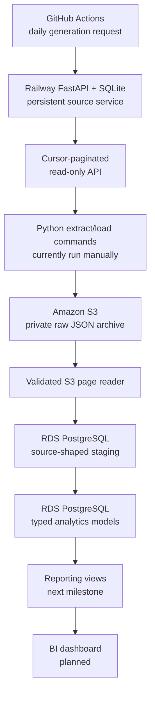

# Guitar Lessons Marketing Analytics — Architecture

This employer-facing portfolio project turns intentionally messy synthetic
marketing and subscription data into trustworthy PostgreSQL models. It
demonstrates Python extraction and loading, a replayable S3 raw layer, typed
SQL transformations, explicit data-quality handling, and—next—reusable
reporting metrics and a BI dashboard.

## 1. Implemented architecture



The source API lives in a separate repository. This analytics repository owns
the API-to-S3 extraction, validated S3-to-PostgreSQL loading, analytics SQL,
and later reporting and dashboard assets.

The implemented path is deliberately S3-first. PostgreSQL never loads an
unarchived API response: the pipeline writes complete API pages to S3, then
rediscovers and validates that exact run before allowing staging writes. This
makes each delivery inspectable and replayable.

## 2. Source service

The Railway service uses FastAPI with SQLite on a persistent volume. GitHub
Actions calls its token-protected generation endpoint daily. Generation is
deterministic, backfills missed dates, and is idempotent for each business
date.

The analytics repository uses only the public read endpoints:

- `GET /health`;
- `GET /status`;
- `GET /tables`;
- `GET /tables/{table_name}/raw?since=<cursor>`.

The API response provides integer `since` and `next_since` cursors. These are
separate from `_raw_row_id`, which identifies a delivered source row and is
stored as text in staging.

## 3. Raw S3 archive

Historical and incremental pages use the same versioned object contract:

```text
raw/<load_type>/<table_name>/
  extract_date=YYYY-MM-DD/
  run_id=YYYYMMDDTHHMMSSffffffZ/
  page-NNNNN.json
```

The private bucket blocks public access and uses SSE-S3 encryption. Each JSON
object retains page metadata plus the complete API response. A selected run is
validated for table identity, wrapper shape, allowed JSON types, page order,
and cursor continuity before database loading.

## 4. PostgreSQL schemas

One encrypted RDS PostgreSQL instance contains three schemas:

| Schema | Implemented responsibility |
|---|---|
| `staging` | Source-shaped text values, raw lineage, object manifests, and API watermarks |
| `analytics` | Typed deduplicated dimensions/facts and source quality issues |
| `reporting` | Stable metric and dashboard views; next milestone |

The connection uses verified TLS. Credentials, endpoints, AWS identifiers,
and the root-certificate path remain in the ignored local environment.

### Staging layer

Seven staging tables preserve intentional source defects rather than hiding
them during ingestion. Each row retains its S3 key, run ID, load type, page,
cursor range, extraction time, and load time.

Each S3 page is applied in one transaction. The loader claims the object,
inserts duplicate-safe rows, and advances the table watermark together. On
failure, all three actions roll back. Replaying an already loaded object skips
it without changing rows or cursors.

### Analytics layer

The implemented analytics layer contains:

- `analytics.dim_plan`;
- `analytics.dim_campaign`;
- `analytics.dim_customer`;
- `analytics.fact_subscription_period`;
- `analytics.fact_payment`;
- `analytics.fact_campaign_daily`;
- `analytics.fact_campaign_assignment`;
- `analytics.data_quality_issue`.

Versioned SQL applies guarded type conversions, whitespace and case
normalization, deterministic `ROW_NUMBER()` deduplication, correction-aware
selection, foreign keys, checks, and indexes. A synthetic campaign with ID
`-1` preserves assignments containing the controlled unmatched campaign ID.
Invalid values, exact duplicates, superseded deliveries, blanks, missing
values, and unknown references remain measurable in the quality table.

Upserts change rows only when selected lineage or typed values differ. The
production runner validates the reviewed staging snapshot and the complete
analytics reconciliation before commit. It can then rerun the transformation
and fingerprint every persisted value, including audit timestamps, to prove
unchanged-input invariance.

## 5. Repository structure

```text
guitar-lessons-marketing-analytics/
├── README.md
├── ARCHITECTURE.md
├── extract_load/
│   ├── config.py
│   ├── extract.py
│   ├── s3_writer.py
│   ├── s3_reader.py
│   ├── staging_rows.py
│   ├── postgres_loader.py
│   ├── watermarks.py
│   ├── run_initial_load.py
│   ├── run_historical_staging_load.py
│   ├── run_incremental_load.py
│   └── run_analytics_transform.py
├── sql/
│   ├── schema/
│   │   ├── 001_create_schemas.sql
│   │   ├── 002_create_staging_tables.sql
│   │   └── 003_create_etl_control.sql
│   ├── staging_to_analytics/
│   │   ├── 001_create_analytics_tables.sql
│   │   └── 002_transform_staging_to_analytics.sql
│   ├── analytics_views/
│   └── reporting_views/
├── docs/
│   ├── data_dictionary.md
│   └── analytics_cleaning_contract.md
├── tests/
│   └── integration/
├── dashboard/screenshots/
└── infra/
```

## 6. Validated milestone state

The selected historical load contained 173 S3 objects and 169,932 staging
rows. A later incremental run added five objects and 213 rows. The reconciled
staging baseline used for analytics therefore contains 178 manifest objects
and 170,145 rows, with no duplicate `_raw_row_id` values.

The initial production analytics transformation committed 166,806 rows across
the seven business models, including the synthetic unknown campaign, plus
5,848 quality records. A complete second transformation over unchanged
staging changed no persisted values. Ordinary tests and opt-in live RDS tests
cover the replay-safe staging loader and rollback-safe analytics validation.

## 7. Current and deferred workflow

The API generation schedule is implemented in GitHub Actions. Historical and
incremental extraction/loading, analytics transformation, and validation are
currently deliberate manual commands. This keeps failure handling observable
while the remaining SQL and dashboard layers are built.

Automatic downstream scheduling has not been selected or implemented. Earlier
plans mentioned Lambda and EventBridge, but those are options rather than
current infrastructure. Scheduling should be chosen only after the reporting
layer and end-to-end manual workflow are complete.

## 8. Remaining build order

1. Build analytics and reporting views for churn, retention, realized value,
   expected 12-month CLV, payment recovery, attributed campaign performance,
   and holdout-based incremental ROI.
2. Add `docs/metric_definitions.md` with grains, formulas, eligibility rules,
   time windows, and denominator handling.
3. Validate every reporting view locally and against RDS, including checks
   that prevent fact-to-fact multiplication.
4. Select Tableau Public or Power BI, build the dashboard, and capture
   repository screenshots.
5. Finish employer-facing setup and architecture documentation.
6. Decide whether and how to schedule the downstream pipeline.

## 9. Reporting design rules

- Paid churn includes cancellation and paid-to-Free movement.
- Pro-to-Master and Master-to-Pro movements are upgrades or downgrades, not
  paid-logo churn.
- CLV uses contribution value rather than revenue alone; CAC remains separate.
- Campaign lift follows intention-to-treat assignment, including holdouts.
- Campaign facts and customer/payment facts must be aggregated to compatible
  grains before joining to avoid row multiplication.
- Dashboard queries read stable `reporting` views rather than reproducing
  metric definitions in the visualization layer.

## 10. Decisions still open

- Tableau Public or Power BI for the dashboard;
- reporting-view refresh and dashboard publication approach;
- exact downstream scheduling mechanism and timing.
