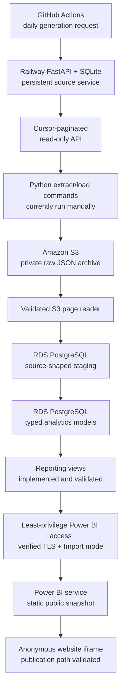

# Guitar Lessons Marketing Analytics — Architecture

This employer-facing portfolio project turns intentionally messy synthetic
marketing and subscription data into trustworthy PostgreSQL models. It
demonstrates Python extraction and loading, a replayable S3 raw layer, typed
SQL transformations, explicit data-quality handling, and reusable reporting
metrics. The BI semantic model and dashboard are the next milestone.

## 1. Implemented architecture



The source API lives in a separate repository. This analytics repository owns
the API-to-S3 extraction, validated S3-to-PostgreSQL loading, analytics and
reporting SQL, and later dashboard assets.

The implemented path is deliberately S3-first. PostgreSQL never loads an
unarchived API response: the pipeline writes complete API pages to S3, then
rediscovers and validates that exact run before allowing staging writes. This
makes each delivery inspectable and replayable.

## 2. Source service

The Railway service uses FastAPI with SQLite on a persistent volume. GitHub
Actions calls its token-protected generation endpoint daily. Generation is
deterministic, backfills missed dates, and is idempotent for each business
date.

The analytics repository uses only the public read endpoints:

- `GET /health`;
- `GET /status`;
- `GET /tables`;
- `GET /tables/{table_name}/raw?since=<cursor>`.

The API response provides integer `since` and `next_since` cursors. These are
separate from `_raw_row_id`, which identifies a delivered source row and is
stored as text in staging.

## 3. Raw S3 archive

Historical and incremental pages use the same versioned object contract:

```text
raw/<load_type>/<table_name>/
  extract_date=YYYY-MM-DD/
  run_id=YYYYMMDDTHHMMSSffffffZ/
  page-NNNNN.json
```

The private bucket blocks public access and uses SSE-S3 encryption. Each JSON
object retains page metadata plus the complete API response. A selected run is
validated for table identity, wrapper shape, allowed JSON types, page order,
and cursor continuity before database loading.

## 4. PostgreSQL schemas

One encrypted RDS PostgreSQL instance contains three schemas:

| Schema | Implemented responsibility |
|---|---|
| `staging` | Source-shaped text values, raw lineage, object manifests, and API watermarks |
| `analytics` | Typed deduplicated dimensions/facts and source quality issues |
| `reporting` | Stable dashboard-facing metric views and additive components |

The connection uses verified TLS. Credentials, endpoints, AWS identifiers,
and the root-certificate path remain in the ignored local environment.

### Staging layer

Seven staging tables preserve intentional source defects rather than hiding
them during ingestion. Each row retains its S3 key, run ID, load type, page,
cursor range, extraction time, and load time.

Each S3 page is applied in one transaction. The loader claims the object,
inserts duplicate-safe rows, and advances the table watermark together. On
failure, all three actions roll back. Replaying an already loaded object skips
it without changing rows or cursors.

### Analytics layer

The implemented analytics layer contains:

- `analytics.dim_plan`;
- `analytics.dim_campaign`;
- `analytics.dim_customer`;
- `analytics.fact_subscription_period`;
- `analytics.fact_payment`;
- `analytics.fact_campaign_daily`;
- `analytics.fact_campaign_assignment`;
- `analytics.data_quality_issue`.

Versioned SQL applies guarded type conversions, whitespace and case
normalization, deterministic `ROW_NUMBER()` deduplication, correction-aware
selection, foreign keys, checks, and indexes. A synthetic campaign with ID
`-1` preserves assignments containing the controlled unmatched campaign ID.
Invalid values, exact duplicates, superseded deliveries, blanks, missing
values, and unknown references remain measurable in the quality table.

Upserts change rows only when selected lineage or typed values differ. The
production runner validates the reviewed staging snapshot and the complete
analytics reconciliation before commit. It can then rerun the transformation
and fingerprint every persisted value, including audit timestamps, to prove
unchanged-input invariance.

### Reporting layer

Seven reusable `analytics` helper views establish the lowest useful grains for
the shared reporting cutoff, paid cohorts, monthly subscription state,
customer-month contribution, CLV checkpoints, payment-recovery episodes, and
campaign-assignment outcomes. Ten `reporting` views then expose stable
dashboard grains for movement, retention, recovery, value, CLV, campaign
delivery, experiment arms, incremental impact, and data quality.

The reporting views retain additive numerators and denominators so rates,
lift, ROAS, ROI, and other non-additive results can be recomputed for the
selected dashboard context. Campaign spend and assignment outcomes are each
reduced to a compatible campaign/window grain before joining. The guarded
production runner verifies the reviewed analytics snapshot, reconciles the
metric components before commit, and reapplies all 17 views to prove unchanged
SQL is replaceable.

## 5. Repository structure

```text
guitar-lessons-marketing-analytics/
├── README.md
├── ARCHITECTURE.md
├── extract_load/
│   ├── config.py
│   ├── extract.py
│   ├── s3_writer.py
│   ├── s3_reader.py
│   ├── staging_rows.py
│   ├── postgres_loader.py
│   ├── watermarks.py
│   ├── run_initial_load.py
│   ├── run_historical_staging_load.py
│   ├── run_incremental_load.py
│   ├── run_analytics_transform.py
│   ├── run_reporting_views.py
│   └── run_bi_access.py
├── sql/
│   ├── schema/
│   │   ├── 001_create_schemas.sql
│   │   ├── 002_create_staging_tables.sql
│   │   └── 003_create_etl_control.sql
│   ├── staging_to_analytics/
│   │   ├── 001_create_analytics_tables.sql
│   │   └── 002_transform_staging_to_analytics.sql
│   ├── analytics_views/
│   │   └── 001_create_reporting_helper_views.sql
│   ├── reporting_views/
│   │   └── 001_create_reporting_views.sql
│   └── bi_access/
│       └── 001_create_bi_reader_role.sql
├── docs/
│   ├── data_dictionary.md
│   ├── analytics_cleaning_contract.md
│   ├── metric_definitions.md
│   └── dashboard_platform_decision.md
├── tests/
│   └── integration/
├── dashboard/screenshots/
└── infra/
```

## 6. Validated milestone state

The selected historical load contained 173 S3 objects and 169,932 staging
rows. A later incremental run added five objects and 213 rows. The reconciled
staging baseline used for analytics therefore contains 178 manifest objects
and 170,145 rows, with no duplicate `_raw_row_id` values.

The initial production analytics transformation committed 166,806 rows across
the seven business models, including the synthetic unknown campaign, plus
5,848 quality records. A complete second transformation over unchanged
staging changed no persisted values.

The reporting milestone committed seven helper views and ten dashboard-facing
views after rollback-only RDS validation. Production reconciliation confirmed
41,458 opening paid observations, 2,664 churned opening observations, 45,261
mature retention checkpoints, 4,109 failed billing episodes, 2,904 campaign
daily rows, 32 incremental measurement windows, and 5,848 quality issues. A
second unchanged-input application produced identical view definitions and
reconciled exactly.

The Power BI connectivity and publication spike then validated the dashboard
delivery path. A versioned `marketing_analytics_bi_reader` `NOLOGIN` role
grants only the approved analytics dimensions and reporting views. A separate
operational login inherits that role, defaults to read-only transactions, and
was verified to be unable to read staging or persist source changes.

Power BI Desktop `2.157.879.0`, 64-bit (August 2026), runs through Parallels.
It connected to RDS through the existing single-public-IP `/32` using verified
TLS after the official Amazon RDS `us-east-1` CA bundle was installed in the
Windows trusted-root store. A manual Desktop refresh succeeded. The remaining
approved BI objects were imported into the canonical working PBIX before a
temporary relocation, and every loaded table was confirmed as Import mode.

An independently controlled Microsoft Entra tenant provides a dedicated
Fabric Free identity and restricts Publish-to-web creation to the security
group `Power BI Publish to Web Creators`. A disposable report and semantic
model were published to `My workspace`; the Fabric Free identity created a
public embed code without Pro or PPU. The public URL rendered without sign-in
in an incognito browser, and the report remained interactive inside a local
HTML iframe. The disposable public artifacts are retained temporarily as a
known-working reference and must be removed when the final portfolio report
replaces them.

## 7. Current and deferred workflow

The API generation schedule is implemented in GitHub Actions. Historical and
incremental extraction/loading, analytics transformation, and validation are
currently deliberate manual commands. This keeps failure handling observable
while dashboard connectivity and modeling are evaluated.

The final public Power BI artifact will be a manually refreshed static Import
snapshot. The Power BI service does not require a gateway, scheduled refresh,
database credentials, DirectQuery, continuous RDS availability, or broader
database ingress. Model and report work can continue offline from the saved
PBIX as long as no source refresh or source-dependent Power Query change is
triggered.

Automatic downstream scheduling has not been selected or implemented. Earlier
plans mentioned Lambda and EventBridge, but those are options rather than
current infrastructure. Scheduling should be chosen only after the reporting
layer, final semantic model, dashboard, and end-to-end manual workflow are
complete.

## 8. Remaining build order

1. Select Power BI and prove secure PostgreSQL connectivity, Import refresh,
   Fabric Free publication, anonymous public access, and iframe behavior.
   **Complete.**
2. Build one standardized Import semantic model with explicit relationships,
   a date table, documented measures, formats, and hidden technical fields.
3. Build a logically thin report against that canonical model, verify the final
   configuration remains compatible with Publish to web, reconcile important
   measures to SQL, and capture repository screenshots.
4. Finish employer-facing setup and documentation.
5. Decide whether and how to schedule the downstream pipeline.

## 9. Reporting design rules

- Paid churn includes cancellation and paid-to-Free movement.
- Pro-to-Master and Master-to-Pro movements are upgrades or downgrades, not
  paid-logo churn.
- CLV uses contribution value rather than revenue alone; CAC remains separate.
- Campaign lift follows intention-to-treat assignment, including holdouts.
- Campaign facts and customer/payment facts must be aggregated to compatible
  grains before joining to avoid row multiplication.
- Dashboard queries read stable `reporting` views rather than reproducing
  metric definitions in the visualization layer.

## 10. Current dashboard decisions and open questions

- Power BI is selected; Desktop runs through Parallels and reads RDS only from
  the authorized public IPv4 `/32`.
- The public report uses a manually refreshed static Import snapshot and
  Publish to web from the independently controlled Fabric Free tenant.
- No Pro purchase, gateway, scheduled service refresh, service-side RDS
  credentials, DirectQuery, paid Fabric capacity, or broadened RDS ingress is
  required for the tested path.
- The next milestone must decide the final relationships, date table, shared
  DAX measures, formats, descriptions, and hidden fields.
- A physically separate thin report will be adopted only if the exact
  configuration is verified as Publish-to-web compatible; one canonical PBIX
  containing the model and report is an acceptable fallback.
- The exact downstream scheduling mechanism and timing remain deferred.
