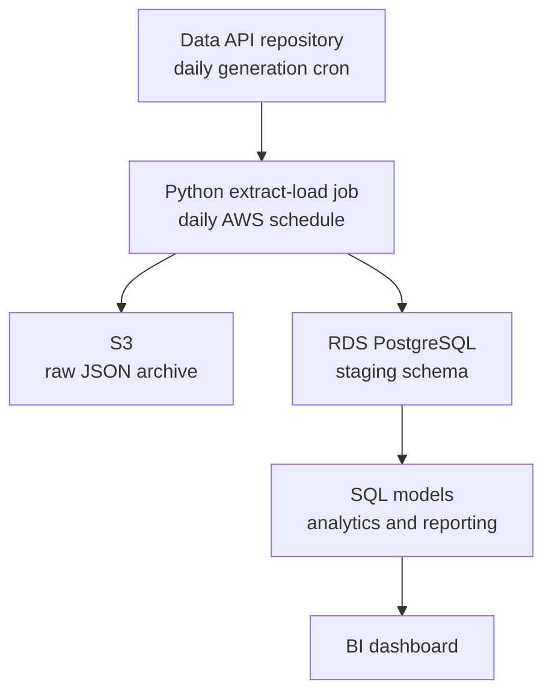

# Guitar Lessons Marketing Analytics — Architecture and Repository Structure

This project turns the Colab prototype into a daily marketing analytics
pipeline on AWS. It collects newly generated API data, preserves the raw data
in S3, loads it into PostgreSQL, transforms it with SQL, and supplies reporting
views to a BI dashboard.

The repository is designed to be easy for an employer to review. The Python,
SQL, documentation, and dashboard materials are separated by purpose, and the
full data flow is visible from the repository structure.

Place this file in the repository root as `ARCHITECTURE.md` and link to it from
`README.md`.

## 1. Project goals

- Build a working AWS pipeline that processes new data each day.
- Use SQL for staging, cleaning, modeling, and reusable reporting views.
- Create churn, customer lifetime value, campaign ROI, and data-quality
  analyses.
- Feed the reporting views into a Tableau Public or Power BI dashboard.
- Present the work in a repository that is clear, reproducible, and easy to
  discuss in an interview.

## 2. Architecture overview



The data API lives in a separate repository. This analytics repository begins
with the Python job that retrieves the API data and continues through storage,
SQL transformation, and dashboarding.

This is an ELT pipeline:

1. **Extract:** retrieve newly available rows from the API.
2. **Load:** save the raw response in S3 and load the rows into PostgreSQL
   staging tables.
3. **Transform:** clean and model the data in PostgreSQL with SQL.

S3 and PostgreSQL receive the same API response in parallel. S3 provides a
durable raw history that can be replayed, while the PostgreSQL staging tables
support the daily SQL workflow.

## 3. Components

### 3.1 Daily data API

The API will live in its own repository and be deployed separately. That
repository will contain:

- the API application;
- the data-generation scripts;
- the current generated dataset or persistent backing store; and
- a cron job that runs the data-generation script once per day.

Each cron run advances the simulated business by one day and appends new messy
records to the relevant source tables. The API then exposes those records to
the analytics pipeline. Generation and extraction are separate processes: the
API creates the data on its own schedule, and the AWS job retrieves it later.

The generator should be idempotent for each business date. If the cron job is
retried, it should detect that the date has already been generated instead of
creating a second copy. The extraction schedule should run after the expected
generation time. Because extraction uses a per-table cursor, a later run can
also collect any rows missed by an earlier run.

A simple API contract is enough:

- `GET /health` — confirms that the service is available.
- `GET /tables` — returns the available table names.
- `GET /tables/{table_name}/raw?since=<raw_row_id>` — returns rows created
  after the supplied cursor.

Every source row should have a stable, increasing `_raw_row_id`. This gives the
analytics pipeline a reliable incremental-extraction key and protects against
duplicate loads.

The API contract, base URL environment variable, response format, and error
behavior should be documented in `extract_load/README.md`.

### 3.2 Python extract-load job

The extract-load job runs once per day after the API generation job. For each
table, it:

1. reads the last successful `_raw_row_id` from the watermark table;
2. requests rows after that cursor;
3. writes the raw JSON response to S3;
4. loads the same rows into the matching PostgreSQL staging table; and
5. updates the watermark after both writes succeed.

AWS Lambda triggered by EventBridge Scheduler is a good fit for this project.
It demonstrates scheduled execution, IAM permissions, S3 access, and a secure
connection to RDS. The Lambda function and RDS instance will share the required
network access, and the deployment package will include dependencies such as
`requests` and `psycopg`.

The control table records extraction progress for each source table:

```sql
staging.etl_watermark (
    table_name,
    last_raw_row_id,
    last_run_at
)
```

Suggested structure:

```text
extract_load/
├── extract_load/
│   ├── extract.py         # Calls the API with the stored watermark
│   ├── load_s3.py         # Writes raw JSON to S3
│   ├── load_staging.py    # Loads rows into PostgreSQL staging
│   ├── watermark.py       # Reads and updates extraction state
│   └── run_daily.py       # Runs the daily workflow
├── requirements.txt
└── README.md              # Documents configuration and the API contract
```

Use date-partitioned S3 keys so each run is easy to inspect and the archive is
ready for tools such as Athena:

```text
s3://<bucket>/raw/table=fact_payment/dt=2026-08-19/part-0001.json
```

### 3.3 RDS PostgreSQL

Use one small RDS PostgreSQL instance with three schemas:

| Schema | Purpose |
|---|---|
| `staging` | Raw API rows and pipeline control data |
| `analytics` | Cleaned tables and reusable analytical models |
| `reporting` | Dashboard-ready metrics and views |

The staging columns can initially preserve the API values as text. The SQL
transformation layer handles validation, type conversion, standardization, and
deduplication before loading the analytics tables.

### 3.4 SQL transformation layer

The SQL is split into small files with clear dependencies:

1. schema and table definitions;
2. staging-to-analytics models;
3. reusable analytics views; and
4. dashboard-facing reporting views.

`run_pipeline.py` executes the files in dependency order immediately after the
daily load. Analytics tables are created once, then updated with idempotent
upserts such as `INSERT ... ON CONFLICT ... DO UPDATE`. This allows the daily
pipeline to be rerun safely.

Keeping one model per file and writing each transformation around a clear
`SELECT` also makes a later dbt migration straightforward.

### 3.5 BI dashboard

The dashboard reads only from the `reporting` schema. This keeps metric logic
in SQL and gives every dashboard page the same definitions.

- **Tableau Public:** publish an extract built from the reporting views.
- **Power BI:** connect to the reporting views and configure a scheduled
  refresh.

The dashboard should present churn and retention, customer lifetime value,
campaign performance, incremental campaign results, and data-quality checks.

## 4. Repository structure

```text
guitar-lessons-marketing-analytics/
├── README.md
├── ARCHITECTURE.md
├── .gitignore
├── extract_load/
│   ├── extract_load/
│   │   ├── extract.py
│   │   ├── load_s3.py
│   │   ├── load_staging.py
│   │   ├── watermark.py
│   │   └── run_daily.py
│   ├── requirements.txt
│   └── README.md
├── sql/
│   ├── schema/
│   │   ├── 001_schemas_and_tables.sql
│   │   └── 002_indexes.sql
│   ├── staging_to_analytics/
│   │   ├── dim_plan.sql
│   │   ├── dim_campaign.sql
│   │   ├── dim_customer.sql
│   │   ├── fact_subscription_period.sql
│   │   ├── fact_payment.sql
│   │   ├── fact_campaign_daily.sql
│   │   └── fact_campaign_assignment.sql
│   ├── analytics_views/
│   │   ├── vw_customer_paid_cohort.sql
│   │   ├── vw_customer_value.sql
│   │   ├── vw_plan_monthly_retention.sql
│   │   ├── vw_expected_12mo_clv_by_plan.sql
│   │   └── vw_campaign_assignment_outcome.sql
│   ├── reporting_views/
│   │   ├── vw_monthly_churn.sql
│   │   ├── vw_retention_cohort.sql
│   │   ├── vw_customer_clv.sql
│   │   ├── vw_campaign_performance.sql
│   │   ├── vw_incremental_campaign_performance.sql
│   │   └── vw_data_quality.sql
│   └── run_pipeline.py
├── docs/
│   ├── data_dictionary.md
│   ├── metric_definitions.md
│   └── architecture-diagram.png
├── dashboard/
│   ├── screenshots/
│   └── notes.md
└── infra/
    └── README.md
```

## 5. SQL file inventory

The SQL layer contains twenty files organized by pipeline stage.

| File | Purpose | Main techniques |
|---|---|---|
| `schema/001_schemas_and_tables.sql` | Create the schemas and seven analytics tables | DDL, primary keys, foreign keys, checks |
| `schema/002_indexes.sql` | Add indexes for customer, campaign, and date lookups | Indexing, `EXPLAIN` |
| `staging_to_analytics/dim_plan.sql` | Clean and deduplicate plans | Casts, `ROW_NUMBER()` |
| `staging_to_analytics/dim_campaign.sql` | Standardize campaign fields | `TRIM`, `INITCAP`, deduplication |
| `staging_to_analytics/dim_customer.sql` | Clean customer fields and validate state codes | Regex, `NULLIF`, deduplication |
| `staging_to_analytics/fact_subscription_period.sql` | Clean subscription periods | Date checks, deduplication |
| `staging_to_analytics/fact_payment.sql` | Validate and cast payment amounts | Regex-guarded casts |
| `staging_to_analytics/fact_campaign_daily.sql` | Validate delivery metrics | Numeric casts, composite-key deduplication |
| `staging_to_analytics/fact_campaign_assignment.sql` | Clean experiment assignments | Text standardization, deduplication |
| `analytics_views/vw_customer_paid_cohort.sql` | Find each customer's first paid-plan month | Aggregation |
| `analytics_views/vw_customer_value.sql` | Calculate realized contribution value by customer | `CASE`, `COALESCE`, date-bounded costs |
| `analytics_views/vw_plan_monthly_retention.sql` | Calculate average monthly retention by plan | `generate_series`, conditional aggregation |
| `analytics_views/vw_expected_12mo_clv_by_plan.sql` | Estimate 12-month CLV by plan | `generate_series`, `POWER()` |
| `analytics_views/vw_campaign_assignment_outcome.sql` | Derive conversion outcomes by campaign type | `UNION ALL`, `EXISTS`, objective-specific joins |
| `reporting_views/vw_monthly_churn.sql` | Report monthly churn, upgrades, and downgrades | `CROSS JOIN`, `FILTER`, `generate_series` |
| `reporting_views/vw_retention_cohort.sql` | Report 1-, 3-, 6-, and 12-month retention | `CASE`, `EXISTS`, cohort logic |
| `reporting_views/vw_customer_clv.sql` | Combine realized value and expected CLV | `LATERAL` join |
| `reporting_views/vw_campaign_performance.sql` | Report CTR, CPC, CAC, and ROAS | Multi-CTE aggregation |
| `reporting_views/vw_incremental_campaign_performance.sql` | Estimate lift, incremental CAC, ROI, and ROAS | Intention-to-treat comparison |
| `reporting_views/vw_data_quality.sql` | Count duplicate, invalid, and unmatched rows | `UNION ALL` quality-event pattern |

## 6. Daily data flow

1. The API repository's cron job runs the data generator and stores that day's
   new source rows.
2. EventBridge triggers the AWS Lambda extract-load job after generation is
   expected to finish.
3. The Lambda job reads each table's watermark and requests newer API rows.
4. The job writes each raw response to S3 and loads the same rows into
   `staging.<table>`.
5. After both writes succeed, the job advances the table's watermark.
6. `run_pipeline.py` updates the analytics tables and reporting views.
7. The BI dashboard refreshes from the `reporting` schema.

## 7. Technology summary

| Layer | Technology | Role in the project |
|---|---|---|
| Data generation and API | Python, FastAPI, separate repository, Railway deployment and cron | Generate and expose new messy data each day |
| Daily pipeline trigger | AWS Lambda and EventBridge Scheduler | Run extraction and loading on a schedule |
| Raw archive | Amazon S3 | Preserve replayable, date-partitioned API responses |
| Database | Amazon RDS for PostgreSQL | Store staging data and run the SQL models |
| Transformation | SQL files and a small Python runner | Build analytics tables and reporting views |
| Dashboard | Tableau Public or Power BI | Present the final business metrics |

## 8. Build order

1. **Build and deploy the API repository.** Add the daily generator, cron job,
   persistent data storage, and incremental endpoints. Confirm that repeated
   runs for the same date remain idempotent.
2. **Create the AWS resources.** Set up the S3 bucket, RDS instance, IAM role,
   networking, Lambda function, and EventBridge schedule. Record the setup in
   `infra/README.md`.
3. **Run the extract-load job manually.** Test one complete API-to-S3 and
   API-to-staging load.
4. **Schedule the daily job.** Set it to run after the API cron job and verify
   several consecutive loads.
5. **Build the seven staging-to-analytics models.** Test cleaning,
   deduplication, constraints, and rerun behavior.
6. **Build the analytics and reporting views.** Validate churn, retention,
   CLV, campaign ROI, and holdout-based incremental results.
7. **Build and publish the dashboard.** Connect it to the reporting views and
   capture screenshots for the repository.
8. **Finish the documentation.** Add the data dictionary, metric definitions,
   setup instructions, architecture diagram, and dashboard link.

## 9. Documentation

- **`README.md`:** project overview, architecture diagram, dashboard link,
  selected SQL examples, link to the API repository, and setup instructions.
- **`docs/data_dictionary.md`:** grain, business key, and column definitions
  for every table.
- **`docs/metric_definitions.md`:** definitions and assumptions for churn,
  retention, CLV, campaign attribution, incremental lift, CAC, ROI, and ROAS.
- **`extract_load/README.md`:** API contract, configuration, watermarks,
  retry behavior, and local execution instructions.
- **`infra/README.md`:** AWS resources, permissions, networking, schedules,
  and deployment steps.
- **`dashboard/notes.md`:** published dashboard link and screenshots.

## 10. Decisions to finalize during implementation

- Tableau Public or Power BI for the dashboard.
- The API's persistent storage format and deployment details.
- The exact daily generation and extraction times.
- The dashboard refresh schedule.
