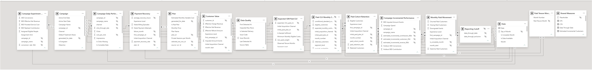
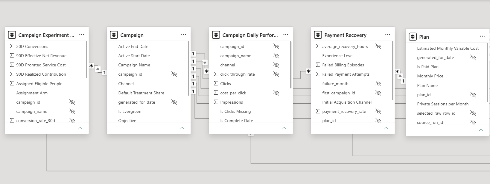
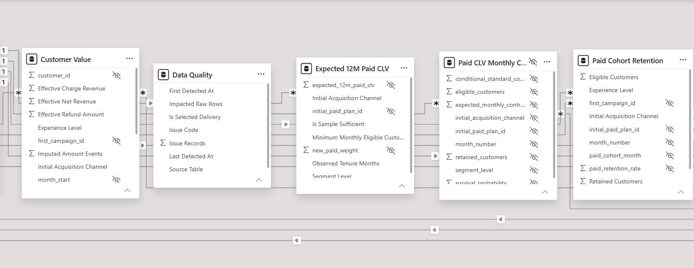
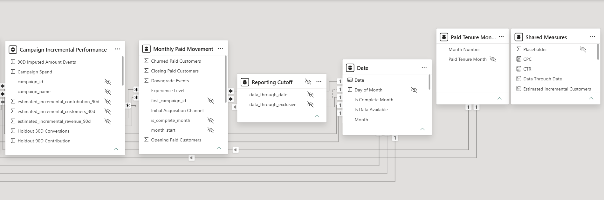
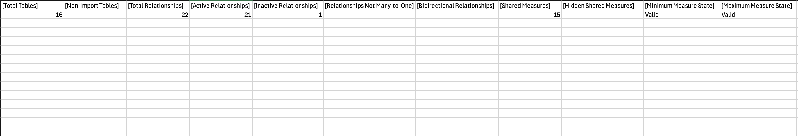
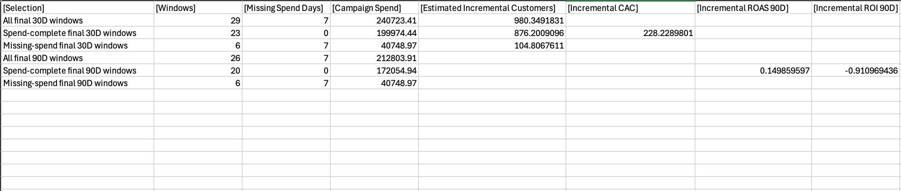

# Power BI Semantic Model

## Status and scope

The canonical Power BI Import semantic model is implemented and validated
against the reviewed reporting snapshot through 2026-08-25. It is the shared
model for the eventual portfolio report; report pages should consume its
dimensions, additive reporting components, and explicit measures instead of
reimplementing stable business rules.

The PBIX is intentionally stored outside Git. This repository records the
model contract, validation results, and non-sensitive screenshots.

August 2026 and measurement window `2026_Q3` are still in progress. The latest
complete calendar month ends on 2026-07-31.

## Responsibility boundary

PostgreSQL owns source cleaning, deterministic delivery selection, typed
business entities, cohort and churn eligibility, billing episodes, experiment
outcomes, campaign/value window alignment, CLV components, and data-quality
classification. Reporting views expose stable grains and additive components.

Power BI owns relationships, shared calendar and tenure dimensions,
filter-context-dependent aggregation, presentation metadata, and report
interaction. A report may use the shared measures but must not independently
recreate churn, retention, CLV, attribution, incrementality, or
spend-completeness logic.

## Validated topology

| Property | Validated state |
|---|---:|
| Tables | 16 |
| Storage mode | Import for all tables |
| Relationships | 22 |
| Active relationships | 21 |
| Inactive relationships | 1 |
| Relationship cardinality | Many-to-one only |
| Cross-filter direction | Single direction only |
| Many-to-many relationships | 0 |
| Bidirectional relationships | 0 |
| Explicit shared measures | 15 visible and valid |

The single inactive relationship is the alternate cohort-date role from
`Date[Date]` to `Monthly Paid Movement[paid_cohort_month]`. All other reviewed
relationships are active. Automatic date/time is disabled, and no automatic
local date tables remain.

## Shared dimensions

### Date

The marked `Date` table contains 1,096 unique dates from 2024-01-01 through
2026-12-31. It provides calendar labels, reviewed sort columns,
data-availability flags, and the complete-month boundary. Technical sort helpers
and `Day of Month` are hidden from ordinary report construction.

Active relationships use the applicable reporting date role: campaign metric
date, measurement-window start, paid cohort month, monthly movement month,
customer-value month, or payment-failure month.

### Campaign and Plan

`Campaign` filters campaign-delivery, experiment, incrementality,
customer-value, paid-movement, retention, and payment-recovery reporting tables through
their approved campaign roles. `Plan` filters paid movement, payment recovery,
retention, and expected-CLV subjects through the documented plan role.

### Paid Tenure Month

`Paid Tenure Month` contains the 12 checkpoints used by paid-cohort retention
and paid-CLV components. Its display label sorts by the hidden numeric month
key. The retention measure deliberately returns blank unless exactly one
checkpoint is selected.

## Reporting subjects and grains

| Model table | Reporting grain or purpose |
|---|---|
| `Monthly Paid Movement` | Month, opening plan, and approved customer segments |
| `Paid Cohort Retention` | Cohort, tenure checkpoint, initial plan, and acquisition segments |
| `Payment Recovery` | Failure month, episode plan/type, and customer segments |
| `Customer Value` | Customer and calendar month |
| `Expected 12M Paid CLV` | Initial paid plan and optional acquisition channel |
| `Campaign Daily Performance` | Campaign and metric date |
| `Campaign Experiment Arm` | Campaign, measurement window, and assignment arm |
| `Campaign Incremental Performance` | Campaign and finalized measurement window |
| `Data Quality` | Source table, issue code, and selected-delivery status |

`Reporting Cutoff` is hidden because its report-facing value is exposed by
`Data Through Date`. `Paid CLV Monthly Component` is hidden because its raw
survival, conditional-margin, and monthly contribution values are not safely
additive across arbitrary segment selections.

Technical keys, duplicated dimension labels, source lineage, fact-date keys
represented by dimensions, unsafe SQL rates, and internal measure inputs are
hidden. Hidden columns continue to support relationships, DAX, and sort-by
behavior.

## Shared measure interface

| Folder | Measures |
|---|---|
| — | `Data Through Date` |
| Billing | `Payment Recovery Rate` |
| Campaign Delivery | `CTR`, `CPC`, `Platform CPA` |
| Campaign Incrementality | `Incremental Conversion Lift`, `Estimated Incremental Customers`, `Incremental CAC`, `Incremental ROAS 90D`, `Incremental ROI 90D` |
| Customer Lifecycle | `Paid Churn Rate`, `Opening Paid Customers Snapshot`, `Paid Cohort Retention Rate` |
| Customer Value | `Expected 12M Paid CLV`, `Realized Contribution` |

All 15 measures are visible, valid, formatted, described, and stored in
`Shared Measures`. The authoritative calculation contracts, exact format
strings, and descriptions are maintained in
[`metric_definitions.md`](metric_definitions.md).

## Validation evidence

The final model checks confirmed:

- `Date` and `Campaign` produced exactly 366, 365, and 237 campaign-daily rows
  per campaign for 2024, 2025, and the available portion of 2026;
- Date/Plan slicing reconciled to 41,458 opening paid-customer exposures and
  2,664 churned customers;
- retention reconciled to 45,261 eligible and 29,782 retained checkpoint rows,
  with exact checkpoint rates of 90.4238%, 74.7111%, 61.7419%, and 47.8042%
  at tenure months 1, 3, 6, and 12;
- a combined tenure selection correctly returned a blank retention rate;
- 23 spend-complete final 30-day windows produced $199,974.44 of spend,
  876.2009 estimated incremental customers, and $228.22898 incremental CAC;
- 20 spend-complete final 90-day windows produced 0.1498596 incremental ROAS
  and -91.09694% incremental ROI; and
- selections containing missing-spend windows correctly returned blank CAC,
  ROAS, and ROI.

Blank zero-count cells in the model-validation screenshot mean that no tables
violated the relevant condition.

## Repository evidence

### Full topology

### Readable model details

### Acceptance results

## Publication and refresh boundary

The final public artifact will remain a manually refreshed static Import
snapshot. No gateway, scheduled Power BI service refresh, service-side RDS
credentials, DirectQuery, paid Fabric capacity, or broadened RDS ingress is
required. Intentional data updates use a reviewed Desktop refresh followed by
republication.

Publish to web makes the report and all included semantic-model data
anonymous and public. Only synthetic portfolio data may be included. The
disposable connectivity-test report, semantic model, and embed code must be
deleted after the final report replaces them.

## Remaining report work

The next milestone is a logically thin report built against this model. It
must test representative slicer behavior, reconcile important visuals to the
validated components, confirm the final configuration still supports Publish
to web, publish the reviewed static snapshot, and replace the disposable
website iframe.
